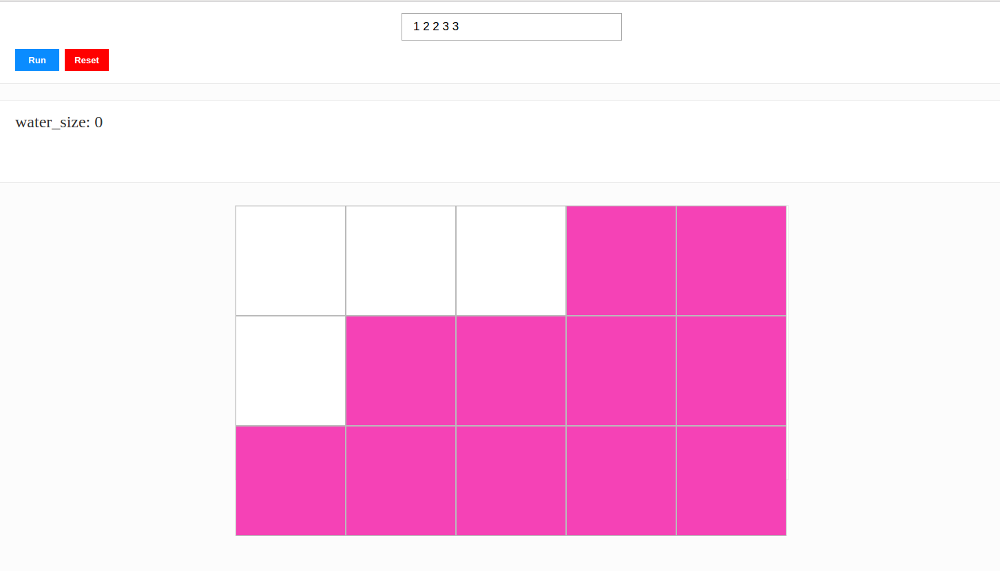
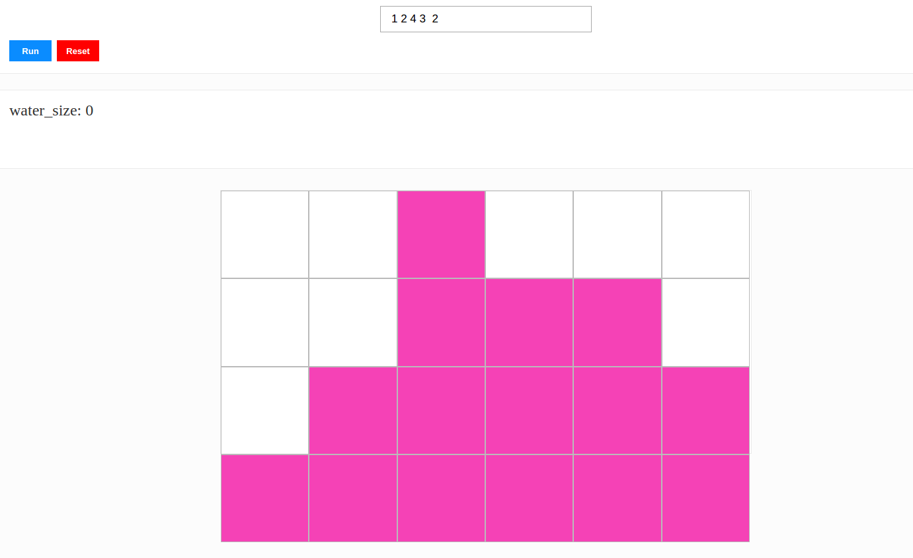
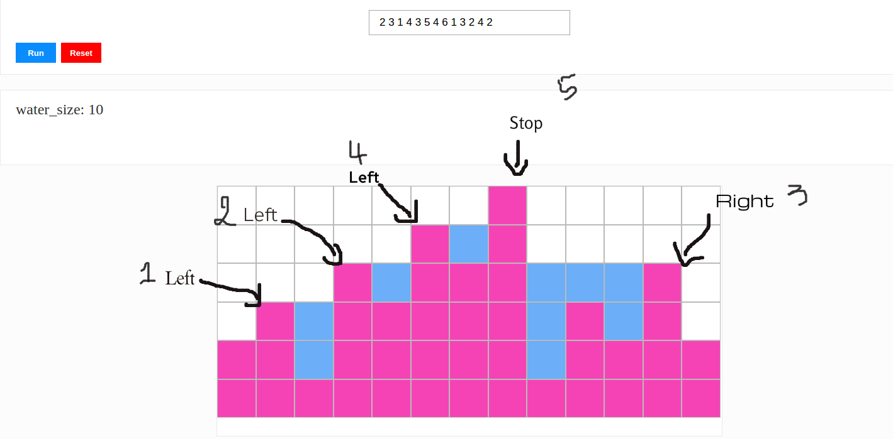

# Solution

### run
- ``yarn install``
- ``yarn test``
- ``yarn start``

## Screen

Two cases when the shape can't make a basin:

- First Case: when all bars from the left to the right are increasing in the height.

- Second Case: When the first case didn't match and the bars from the right to the left are increasing in the height till it reaches the cursor i.

And now if our case didn't match the two cases above then we can conclude that we have at least one basin.
the basin has a left bar and a right bar so depends on this : "The water in one cell always flows to the neighboring cell of least height"

we are always going to pick the min height between the left and the right bar
and then we can calculate the water_size by subtraction between the height of
the current picked bar and the height of the next bar and this depends on the
direction that we are in if it's from left to right or the inverse.

The last commit is about improving the map construction via an asynchronous work

